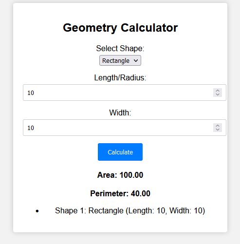

## Opdracht 1: Calculate Surfaces

### Opdrachtomschrijving

In deze opdracht bouw je een applicatie die de oppervlakte en omtrek van een rechthoek, vierkant of cirkel berekent. De gebruiker kan de vorm selecteren en de lengte en breedte invoeren. De applicatie berekent dan de oppervlakte en omtrek van de vorm en toont deze op het scherm.

### Functionele vereisten

- De gebruiker kan een vorm selecteren uit een dropdown menu
- De gebruiker kan de lengte en breedte van de vorm invoeren
	- De breedte is alleen zichtbaar als de gebruiker een rechthoek selecteert 
- De gebruiker kan op een knop klikken om de oppervlakte en omtrek van de vorm te berekenen
- De gebruiker kan de oppervlakte en omtrek van de vorm zien op het scherm

#### Bonus 

Je kan bonuspunten verdienen door de vormen te modelleren als types of interfaces en objecten aan te maken voor de vormen. Je kan deze objecten dan opslaan in een lijst en ze tonen in een lijst.

### Technische vereisten

- De applicatie is geschreven in TypeScript
- De applicatie maakt gebruik van een switch statement om de juiste berekening uit te voeren
- De applicatie valideert de invoer van de gebruiker en toont een foutmelding als de invoer ongeldig is

### Voorbeeld

### Beoordelingscriteria

Correctiematrix voor TypeScript-oefening (Totaal punten: 20)

1. Variabelen Declaratie en Ophalen van DOM-elementen (2 punten):
   - Variabelen voor HTML-elementen zijn correct gedeclareerd en geïnitialiseerd. (2 punten)

2. Behandeling van Selectie van Vormen (2 punten):
   - De selectie van vormen in de dropdown werkt correct en toont het breedte-invoerveld op basis van de geselecteerde vorm. (2 punten)

3. Invoervalidatie (3 punten):
   - Correcte validatie voor invoer van lengte en breedte, inclusief NaN, negatieve waarden en lege velden. (3 punten)

4. Berekeningslogica (6 punten):
   - Berekent correct het oppervlakte en omtrek voor de vormen Rechthoek, Vierkant en Cirkel. (2 punten per vorm)

5. Gebruik van Schakelverklaring (2 punten):
   - Correct gebruik van de schakelverklaring om vormspecifieke berekeningen af te handelen. (2 punten)

6. Weergave van Resultaten (3 punten):
   - Werkt de DOM bij met de berekende waarden voor oppervlakte en omtrek. (3 punten)

7. Structuur en Leesbaarheid van de Code (2 punten):
   - Correcte inspringing en code-structuur. (1 punt)
   - Gebruik van duidelijke en betekenisvolle variabele- en functienamen. (1 punt)

8. Code-opmerkingen en Documentatie (2 punten):
   - Voldoende opmerkingen die de doelstellingen van belangrijke codeblokken en secties uitleggen. (2 punten)

9. Bonuspunten (variabel):
		- Je gebruikt types of interfaces voor de vormen en je maakt objecten ervoor aan die je opslaat in een een lijst.
		- Je toont de vormen in een lijst op het scherm.

